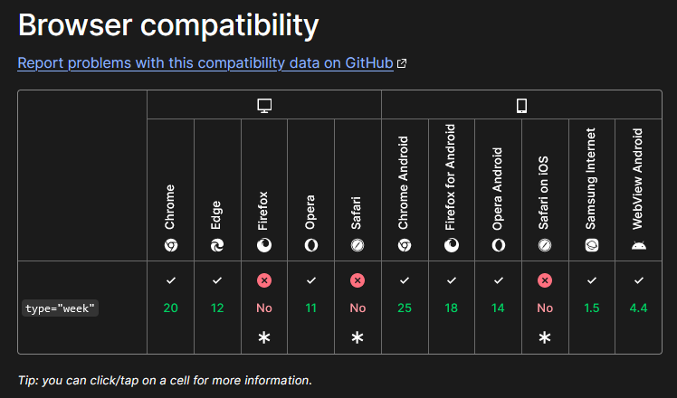

# ea11y-kit - Biblioteca de componentes acessíveis em React.

Biblioteca de componentes em React pré-configurados com as recomendações do [eMAG (Modelo de Acessibilidade em Governo Eletrônico)](https://emag.governoeletronico.gov.br/). Entretanto, nesta biblioteca as recomendações são tratadas como diretrizes, exigindo que o desenvolvedor utilize dos componentes de maneira conforme com o eMAG.

# Componentes desenvolvidos:

## Formulário:

### Button
Botão `<button>` configurado com as diretrizes do eMAG. Não há bem uma diretriz estabelecida para botões. Há a diretriz **6.1 – Fornecer alternativa em texto para os botões de imagem de formulários** porém está diz respeito ao elemento `<input type='image' />`, que foi configurado e nomeado nesta biblioteca como `Image Button`.

#### Diretrizes adotadas
- 4.4 – Possibilitar que o elemento com foco seja visualmente evidente;
    - Uma borda é acrescentada ao componente ao ser focado;

#### Props API
| Prop | Descrição | Obrigatória | Valor padrão |
| ---- | --------- | ----------- | ------------ |
| type | Define o tipo do botão, podendo ser: `button`, `submit` e `reset`. | Não | "button" |
| children | Define o conteúdo do botão. | Sim |  |
| css | Permite customizar o componente via css-in-js. [Saiba mais sobre sobrescrever CSS aqui](https://stitches.dev/docs/overriding-styles) | Não | |

Além disso, pode se passar qualquer propriedade e método oferecido pela interface [HTMLButtonElement](https://developer.mozilla.org/en-US/docs/Web/API/HTMLButtonElement).

### Checkbox
Checkbox permite trabalhar com campos selecionaveis. Seguindo as diretrizes do eMAG, o componente exige que seja informado um `id` e uma `label`, que permite identificar o campo. Além disso, a prop `required` permite especificar se o campo é obrigatório ou não, e caso seja colocado que sim é acrescentado a indicação `(campo obrigatório)` na frente do texto da label, conforme descreve a diretriz **6.5 – Fornecer instruções para entrada de dados**.

#### Diretrizes adotadas

- 2.1 - Disponibilizar todas as funções da página via teclado;
  - Por padrão, o elemento `<input type="checkbox">` permite interação via tecla espaço;
- 4.4 – Possibilitar que o elemento com foco seja visualmente evidente
  - Ao focar no elemento é adicionado uma borda;
- 6.2 – Associar etiquetas aos seus campos
  - Deve-se informar, obrigatoriamente, uma `label` e um `id`para identificar o campo.
  
#### Props API
| Prop | Descrição | Obrigatória | Valor padrão |
| ---- | --------- | ----------- | ------------ |
| label | Define uma descrição (rótulo) do campo de entrada. | Sim | |
| id | Define um identificador para o campo. deve ser único | Sim | | 
| required| Define se o campo é obrigatório ou não. O indicativo `(campo obrigatório)` é colocado a frente do campo quando esta flag é igual a true. | Não | false |
| name | Define o nome do campo. | Sim | |
| onChange | Define uma função callback para quando o componente for selecionado ou não selecionado. | Não | |
| checked | Define se o checkbox está selecionado ou não selecionado | Não | |
| css | Permite customizar o componente via css-in-js. [Saiba mais sobre sobrescrever CSS aqui](https://stitches.dev/docs/overriding-styles) | Não | |

Além disso, pode se passar qualquer propriedade e método oferecido pela interface [HTMLInputElement](https://developer.mozilla.org/en-US/docs/Web/API/HTMLInputElement).
 

### Color
Input do tipo (type) `color` que permite trabalhar com seleção de cores. Seguindo as diretrizes do eMAG, o componente exige que seja informado um `id` e uma `label`, que permite identificar o campo. Além disso, a prop `required` permite especificar se o campo é obrigatório ou não, e caso seja colocado que sim é acrescentado a indicação `(campo obrigatório)` na frente do texto da label.

##### Diretrizes adotadas
- 4.4 – Possibilitar que o elemento com foco seja visualmente evidente
  - Ao focar no elemento é adicionado uma borda;
- 6.2 – Associar etiquetas aos seus campos
  - Deve-se fornecer um `id` e uma `label` para identificar o campo;
- 6.5 – Fornecer instruções para entrada de dados;
  - Ao definir o campo como obrigatório através da prop `required`, é adicionado a instrução `(campo obrigatório)` na frente da label.

##### Props API
| Prop | Descrição | Obrigatória | Valor padrão |
| ---- | --------- | ----------- | ------------ |
| label | Define uma descrição (rótulo) do campo de entrada. | Sim | |
| name | Define o nome do campo. | Sim | |
| id | Define um identificador para o campo. deve ser único | Sim | | 
| required| Define se o campo é obrigatório ou não. O indicativo `(campo obrigatório)` é colocado a frente do campo quando esta flag é igual a true. | Não | false |
| css | Permite customizar o componente via css-in-js. [Saiba mais sobre sobrescrever CSS aqui](https://stitches.dev/docs/overriding-styles) | Não | |

### Image Button
Botão gráfico para submissão de formulários (`<input type='image' />`). É exigido que seja fornecido um texto alternativo para a imagem utilizada no botão, conforme a diretriz **6.1 – Fornecer alternativa em texto para os botões de imagem de formuláriosdo eMAG**.

#### Props API
| Prop | Descrição | Obrigatória | Valor padrão |
| ---- | --------- | ----------- | ------------ |
| src  | Utiliza-se para informar o local (link) da imagem | Sim | | 
| alt  | Permite definir um texto alternativo para a imagem utilizada. | Sim | | 
| css | Permite customizar o componente via css-in-js. [Saiba mais sobre sobrescrever CSS aqui](https://stitches.dev/docs/overriding-styles) | Não | |

#### Diretrizes adotadas
- 4.4 – Possibilitar que o elemento com foco seja visualmente evidente;
    - Uma borda é acrescentada ao componente ao ser focado;
- 6.1 – Fornecer alternativa em texto para os botões de imagem de formulários
    - Deve-se fornecer um texto alternativo para o componente via prop `alt`.

Além disso, pode se passar qualquer propriedade e método oferecido pela interface [HTMLInputElement](https://developer.mozilla.org/en-US/docs/Web/API/HTMLInputElement).

### Month

### Phone

### RadioButton

### Range

### Select

### Textarea
Textarea permite trabalhar com entrada de textos extensos. Adotando as diretrizes do eMAG, o componente exige que seja informado uma `label` e um `id`, que permite identificar o campo. Além disso, através da prop obrigatória `placeholder` é descrito ao usuário o que deve ser inserido no campo. A prop `required` permite especificar se o campo é obrigatório ou não, e caso seja colocado que sim é acrescentado a indicação `(campo obrigatório)` na frente do texto da label.

#### Diretrizes adotadas
- 4.4 – Possibilitar que o elemento com foco seja visualmente evidente;
    - Uma borda é adicionada ao elemento ao ser focado.
- 6.2 – Associar etiquetas aos seus campos;
    - A propriedade `label` e `id` são obrigatórias.
- 6.5 – Fornecer instruções para entrada de dados.
    - A propriedade `placeholder` é obrigatória.
    - É adicionado a indicação `(campo obrigatório)` ao definir a prop required como `true`.

#### Props API
| Prop | Descrição | Obrigatória | Valor padrão |
| ---- | --------- | ----------- | ------------ |
| label | Define uma descrição (rótulo) do campo de entrada. | Sim | |
| placeholder | Define uma instrução sobre o dado que deve ser informado | Sim | |
| id | Define um identificador para o campo. deve ser único | Sim | | 
| required| Define se o campo é obrigatório ou não. O indicativo `(campo obrigatório)` é colocado a frente do campo quando esta flag é igual a true. | Não | false |
| name | Define o nome do campo. | Sim | | 
| css | Permite customizar o componente via css-in-js. [Saiba mais sobre sobrescrever CSS aqui](https://stitches.dev/docs/overriding-styles) | Não | |

Além disso, pode se passar qualquer propriedade e método oferecido pela interface [HTMLTextAreaElement](https://developer.mozilla.org/en-US/docs/Web/API/HTMLTextAreaElement).

### UploadField
Campo para anexação de arquivos. Adotando os diretrizes do eMAG, o componente exige um `id` e `label` para identificar o campo. A prop `required` permite especificar se o campo é obrigatório ou não, e caso seja colocado que sim é acrescentado a indicação `(campo obrigatório)` na frente do texto da label. Além disso, `accept` e `acceptDescription` trabalham juntos para fornecer um meio para apresentar e descrever para o usuário quais arquivos podem ser anexados.

#### Diretrizes adotadas

- 3.5 – Descrever links clara e sucintamente
  - É demonstrado para o usuário detalhes do arquivo que ele anexou, como: nome do arquivo, tamanho do arquivo em kb e a extensão
- 4.4 – Possibilitar que o elemento com foco seja visualmente evidente
  - Ao focar no elemento é demontrado uma borda;
- 6.2 – Associar etiquetas aos seus campos
  - A propriedade `label` e `id` são obrigatórias;
- 6.5 – Fornecer instruções para entrada de dados
   - A propriedade `placeholder` é obrigatória;
   - É adicionado a indicação `(campo obrigatório)` ao definir a prop required como `true`.

##### Props API
| Prop | Descrição | Obrigatória | Valor padrão |
| ---- | --------- | ----------- | ------------ |
| label | Define uma descrição (rótulo) do campo de entrada. | Sim | |
| id | Define um identificador para o campo. deve ser único | Sim | | 
| required | Define se o campo é obrigatório ou não. O indicativo `(campo obrigatório)` é colocado a frente do campo quando esta flag é igual a true. | Não | false |
| css | Permite customizar o componente via css-in-js. [Saiba mais sobre sobrescrever CSS aqui](https://stitches.dev/docs/overriding-styles) | Não | |
| accept | Define quais formatos devem ser anexados. Deve-se informar uma string e separar cada extensão utilizando vírgulas. Ex: image/png, image/jpeg. [Clique aqui para ver quais formatos podem ser informados](https://developer.mozilla.org/en-US/docs/Web/HTML/Attributes/accept) | Não | |
| acceptDescription | Apresenta para o usuário quais formatos devem ser anexados. | É obrigatório quando é informado o `accept`. | |

Além disso, pode se passar qualquer propriedade e método oferecido pela interface [HTMLInputElement](https://developer.mozilla.org/en-US/docs/Web/API/HTMLInputElement).

### Textbox
Textbox permite trabalhar com campo de entrada para email, número, senha, pesquisa, texto, URL, data (date e datetime-local) e hora. Adotando as diretrizes do eMAG, o componente exige que seja informado uma `label` e um `id`, que permite identificar o campo. Além disso, através da prop obrigatória `placeholder` é descrito ao usuário o que deve ser inserido no campo. A prop `required` permite especificar se o campo é obrigatório ou não, e caso seja colocado que sim é acrescentado a indicação `(campo obrigatório)` na frente do texto da label.
 
#### Diretrizes adotadas
- 4.4 – Possibilitar que o elemento com foco seja visualmente evidente;
    - Uma borda é adicionada ao elemento ao ser focado.
- 6.2 – Associar etiquetas aos seus campos;
    - A propriedade `label` e `id` são obrigatórias.
- 6.5 – Fornecer instruções para entrada de dados.
    - A propriedade `placeholder` é obrigatória.
    - É adicionado a indicação `(campo obrigatório)` ao definir a prop required como `true`.

#### Props API
| Prop | Descrição | Obrigatória | Valor padrão |
| ---- | --------- | ----------- | ------------ |
| label | Define uma descrição (rótulo) do campo de entrada. | Sim | |
| placeholder | Define uma instrução sobre o dado que deve ser informado | Sim | |
| id | Define um identificador para o campo. deve ser único | Sim | | 
| required| Define se o campo é obrigatório ou não. O indicativo `(campo obrigatório)` é colocado a frente do campo quando esta flag é igual a true. | Não | false |
| name | Define o nome do campo. | Sim | | 
| css | Permite customizar o componente via css-in-js. [Saiba mais sobre sobrescrever CSS aqui](https://stitches.dev/docs/overriding-styles) | Não | |
| type | Define o tipo do campo. Valores permitidos: `email`, `number`, `password`, `search`, `text`, `url`, `date`, `datetime-local` e `time`. Utilize `Phone` se precisar usar o tipo `tel` e utilize o componente `Week` se precisar adotar o uso do tipo `week`  | text |

Além disso, pode se passar qualquer propriedade e método oferecido pela interface [HTMLInputElement](https://developer.mozilla.org/en-US/docs/Web/API/HTMLInputElement).

### Week
Campo para seleção de semanas, ou seja, input com o type week. É exigido que seja informado uma `label` e um `id` para identificar o campo. A prop `required` permite especificar se o campo é obrigatório ou não, e caso seja colocado que sim é acrescentado a indicação `(campo obrigatório)` na frente do texto da label.

#### Diretrizes adotadas

- 4.4 – Possibilitar que o elemento com foco seja visualmente evidente;
    - Uma borda é adicionada ao elemento ao ser focado.
- 6.2 – Associar etiquetas aos seus campos;
    - A propriedade `label` e `id` são obrigatórias.
- 6.5 – Fornecer instruções para entrada de dados.
    - A propriedade `placeholder` é obrigatória.

#### Compatibilidade com navegadores

De acordo com a biblioteca da MDN, os seguintes navegadores possuem compatibilidade com o `type week`:

[Veja mais sobre compatibilidade dos navegadores com o input week](https://developer.mozilla.org/en-US/docs/Web/HTML/Element/input/week#browser_compatibility).
Imagem consultada em: 16/04/2024.

Nesse sentido, caso o navegador não suporte o tipo week, é utilizado um componente fallback, [seguindo o exemplo proposto pela MDN](https://developer.mozilla.org/en-US/docs/Web/HTML/Element/input/week#examples).

O componente fallback consiste em dois selects, sendo que um permite selecionar o ano e o outro o número da semana.

#### Props API
`fallbackYearOptions`, `fallbackWeekCss` e `fallbackWeekYearCss` são props para customização do componente fallback, que é renderizado quando o navegador não suporta o `type week`. 

| Prop | Descrição | Obrigatória | Valor padrão |
| ---- | --------- | ----------- | ------------ |
| label | Define uma descrição (rótulo) do campo de entrada. | Sim | |
| id | Define um identificador para o campo. deve ser único | Sim | | 
| required| Define se o campo é obrigatório ou não. O indicativo `(campo obrigatório)` é colocado a frente do campo quando esta flag é igual a true. | Não | false |
| name | Define o nome do campo. | Sim | | 
| css | Permite customizar o componente via css-in-js. [Saiba mais sobre sobrescrever CSS aqui](https://stitches.dev/docs/overriding-styles) | Não | |
| fallbackYearOptions | Define quais anos anos serão utilizados no select. | Não | `Array<number>` Lista dos dez anos anteriores ao ano atual |
| fallbackWeekCss | Permite customizar o select da semana. | Não | |
| fallbackWeekYearCss | Permite customizar o select do ano | Não | |

### DownloadLink
DownloadLink é utilizado para link de arquivos que podem ser baixados. O componente é configurado para exija informações do arquivo, como: nome do arquivo, extensão, tamanho e unidade (Kb, Mb, Gb), como descreve a diretriz **3.5 – Descrever links clara e sucintamente**.

#### Diretrizes adotadas
- 3.5 – Descrever links clara e sucintamente. Ressalta-se que a qualidade da descrição do link recai sobre o desenvolvedor, que deve se atentar a esse quesito;
- 4.4 – Possibilitar que o elemento com foco seja visualmente evidente;
    - Uma borda é acrescentada ao componente ao ser focado;

#### Props API
| Prop | Descrição | Obrigatória | Valor padrão |
| ---- | --------- | ----------- | ------------ |
| href | Define o link do local onde o arquivo se encontra. | Sim | | 
| fileName | Define o nome do arquivo sem a extensão. | Sim | |
| extension | Define a extensão do arquivo, exemplo: `.txt`, `.pdf` | Sim | |
| unit | define a unidade do tamanho do arquivo, exemplo: `KB`, `MB`, etc... | Sim | 
| size | define o tamanho do arquivo com base na unidade | Sim | |
| css | Permite customizar o componente via css-in-js. [Saiba mais sobre sobrescrever CSS aqui](https://stitches.dev/docs/overriding-styles). | Não | |

### Link
Link é utilizado para navegar entre páginas internas e externas. No que diz respeito a páginas externas, ao definir o `target` como `_blank` é adicionado o texto `(abre em nova guia)` para que o usuário saiba que uma nova guia será aberta, como descreve a diretriz **1.9 – Não abrir novas instâncias sem a solicitação do usuário**. 

#### Diretrizes adotadas

- 1.9 – Não abrir novas instâncias sem a solicitação do usuário;
    - Uma descrição é acrescentada a descrição do link quando se refere a uma URL externa;
- 4.4 – Possibilitar que o elemento com foco seja visualmente evidente;
    - Uma borda é acrescentada ao componente ao ser focado;

#### Props API
| Prop | Descrição | Obrigatória | Valor padrão |
| ---- | --------- | ----------- | ------------ |
| children | Define o conteúdo do componente, ou seja, o texto descritivo do link. Deve-se evitar o uso de  "clique aqui", "leia mais", "mais", "saiba mais", "veja mais" e "acesse a lista". [Veja diretriz 3.5 do eMAG para mais informações](https://emag.governoeletronico.gov.br/) | Sim | |
| href | Define o link para a navegação. | Sim | |
| target | Define em qual instância o link irá se abrir, exemplo: nova guia, pagina atual, etc. Se target for igual a `_blank` será acrescentado na frente da descrição do link a indicação `(abre em nova guia)` | Não | |
| css | Permite customizar o componente via css-in-js. [Saiba mais sobre sobrescrever CSS aqui](https://stitches.dev/docs/overriding-styles). | Não | |

Além disso, pode se passar qualquer propriedade e método oferecido pela interface [HTMLAnchorElement](https://developer.mozilla.org/en-US/docs/Web/API/HTMLAnchorElement).

### Image 

Image é utilizado para renderizar imagens simples e requer que seja informado via prop um texto alternativo (alt), conforme descreve a diretriz **3.6 – Fornecer alternativa em texto para as imagens do sítio**.

#### Diretrizes adotadas
-  3.6 – Fornecer alternativa em texto para as imagens do sítio;
    - É obrigatório informar um texto alternativo através da prop `alt`;

#### Props API
| Prop | Descrição | Obrigatória | Valor padrão |
| ---- | --------- | ----------- | ------------ |
| src  | Define a URL da imagem. | Sim | |
| alt  | Define o texto alternativo da imagem. | Sim | |
| css  | Permite customizar o componente via css-in-js. [Saiba mais sobre sobrescrever CSS aqui](https://stitches.dev/docs/overriding-styles) | Não | |

Além disso, pode se passar qualquer propriedade e método oferecido pela interface [HTMLImageElement](https://developer.mozilla.org/en-US/docs/Web/API/HTMLImageElement).

### Figure
Figure é utilizado para renderização de ilustrações, trechos de códigos entre outros elementos mais complexos, e requisita como prop obrigatória um texto alternativo (alt) e uma legenda, como descreve a diretriz **3.6 – Fornecer alternativa em texto para as imagens do sítio**.

#### Diretrizes adotadas
-  3.6 – Fornecer alternativa em texto para as imagens do sítio;
    - É obrigatório informar uma legenda (caption);

#### Props API
| Prop | Descrição | Obrigatória | Valor padrão |
| ---- | --------- | ----------- | ------------ |
| caption | Define a legenda do elemento Figure. | Sim | |
| children | Define o conteúdo do elemento Figure, podendo ser "linhas de códigos, imagens, gráficos, diagramas e vídeos que fazem referência ao conteúdo principal do documento."(eMAG, 2014) | Sim | |
| css | Permite customizar o componente via css-in-js. [Saiba mais sobre sobrescrever CSS aqui](https://stitches.dev/docs/overriding-styles) | Sim | |

Além disso, pode se passar qualquer propriedade e método oferecido pela interface [HTMLElement](https://developer.mozilla.org/en-US/docs/Web/API/HTMLElement).

### Table

Table é composto pelos sub-componentes DataCell (`td`), HeaderCell (`<th>`), Root (`<table>`) e Row (`tr`). Através do componente Root a tabela é construída, nesse sentido deve-se utilizar das props `theadChildren` para informar o cabeçalho da tabela, `tbodyChildren` o corpo e `tfootChildren` o rodapé. Todo conteúdo passado para `theadChildren` é encapsulado dentro de um `<thead>`, assim como o conteúdo de `tbodyChildren` é encapsulado dentro de `<tbody>` e `tfootChildren` é encapsulado dentro de `<tfoot>`. Com esse ecapsulamento busca-se garantir conformidade com a diretriz **3.10 – Associar células de dados às células de cabeçalho**.
Em Root pode-se notar as props `summary` e `caption`, sendo o primeiro opcional e representa um resumo do conteúdo da tabela e o segundo se trata de uma prop obrigatória e deve ser informado para especificar um título para a tabela. Ressalta-se que apesar de `summary` ser opcional, deve-se fornecer um resumo quando o conteúdo da tabela for extenso, conforme descreve a diretriz **3.9 - Em tabelas, utilizar títulos e resumos de forma apropriada**. 

#### Diretrizes adotadas

- 3.9 - Em tabelas, utilizar títulos e resumos de forma apropriada;
    - Utiliza-se da prop caption para definir um título para a tabela e utiliza-se `summary` para apresentar um resumo da tabela.
- 3.10 – Associar células de dados às células de cabeçalho;
    - A composição da tabela através do componente Root permite que a montagem da tabela ocorra de maneira estruturada;

#### Props API

### Video

Reprodutor de vídeo com controles customizados, com o uso obrigatório de legendas, arquivo textual alternativo e de audiodescrição. As legendas são obrigatórias para que pessoas com deficiência auditivas, sem aparelhos de som ou que apenas queiram ler o material possam consumir o conteúdo do arquivo multimídia, conforme descreve a diretriz **5.1 - Fornecer alternativa para vídeo**. O eMAG não apresenta esse requisito como obrigatório, mas foi contemplado na biblioteca e exigido como prop do componente um arquivo textual que representa uma alternativa em texto do vídeo. Audiodescrição é colocado como opcional, pois seu uso é requerido quando "vídeos que transmitem conteúdo visual que não está disponível na faixa de áudio devem possuir uma audiodescrição." (eMAG, 2014). Portanto, será requisitado apenas o uso de legendas e do arquivo textual alternativo.
O eMAG cita que "é desejável que os vídeos com áudio apresentem alternativa na Língua Brasileira de Sinais (Libras)." (eMAG, 2014). Entretanto, esse recurso não é contemplado na biblioteca.

#### Diretrizes adotadas

- 5.1 - Fornecer alternativa para vídeo;
    - Legendas e texto alternativo são props obrigatórias;
- 5.3 -  Oferecer audiodescrição para vídeo pré-gravado;
    - Opcional, mas pode-se informar audiodescrição através da prop `tracks`, definindo como valor 'description' para `kind`. Como tracks é uma lista, basta que um dos elementos da lista contenha a configuração citada anteriomente.
- 5.4 – Fornecer controle de áudio para som;'
    - É oferecido controles para reproduzir, pausar, parar e controlar o volume do vídeo;
- 4-4 - Possibilitar que o elemento com foco seja visualmente evidente: os controles de interação recebem uma borda ao serem focados.
    - Os controles do player possuem bordas ao serem focados.

#### Props API
| Prop | Descrição | Obrigatória | Valor padrão |
| ---- | --------- | ----------- | ------------ |
| sources | Lista com os links dos vídeos. Pode-se informar o link do mesmo vídeo, mas em formato diferentes para que o navegador utilize como "fallback" caso não consiga reproduzir um formato específico | Sim | |
| css | Permite customizar o componente via css-in-js. [Saiba mais sobre sobrescrever CSS aqui](https://stitches.dev/docs/overriding-styles) | Sim | |
| tracks | Permite especificar as legendas do vídeo. Deve-se informar as legendas no formato `.vtt`. Para audiodescrição, deve-se especificar para o atributo `kind` o valor `descriptions`. | Sim | |
| textualAlternativeFile | Arquivo textual alternativo do conteúdo do vídeo. | Sim | |

Além disso, pode se passar qualquer propriedade e método oferecido pela interface [HTMLVideoElement](https://developer.mozilla.org/en-US/docs/Web/API/HTMLVideoElement).

### Audio

Reprodutor de áudio com controles customizados, com o uso obrigatório de alternativa textual e legendas. A alternativa textual e a legenda são importantes para pessoas com deficiência auditiva, pessoas sem equipamento de som ou que desejam apenas realizar a leitura do material, conforme descreve a diretriz **5.2 – Fornecer alternativa para áudio**.

#### Diretrizes adotadas

- 5.2 – Fornecer alternativa para áudio;
    - Legenda e o arquivo textual são obrigatórios.
- 5.4 – Fornecer controle de áudio para som;
    - É disponibilizado botões para reproduzir, pausar, alterar o idioma da legenda, controlar o volume e o tempo;
- 4.4 – Possibilitar que o elemento com foco seja visualmente evidente.
    - Cada controle utilizado recebe uma borda ao ser focado.

#### Props API
| Prop | Descrição | Obrigatória | Valor padrão |
| ---- | --------- | ----------- | ------------ |
| sources | Lista dos arquivos de áudio. Pode-se informar o link do mesmo áudio, mas em formato diferentes para que o navegador utilize como "fallback" caso não consiga reproduzir um formato específico | Sim | |
| captionFile | Alternativa textual do conteúdo do áudio.  | Sim | |
| tracks | Permite especificar as legendas do vídeo. Deve-se informar as legendas no formato `.vtt`. | Sim | |

### ModalDialog e NonModalDialog
Em desenvolvimento...

### Slideshow
Em desenvolvimento...

# Referências
- https://emag.governoeletronico.gov.br/;
https://medium.com/hackernoon/creating-a-library-of-react-components-using-create-react-app-without-ejecting-d182df690c6b